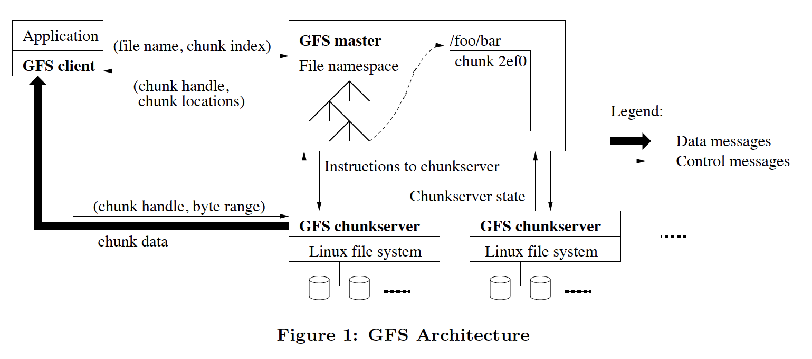
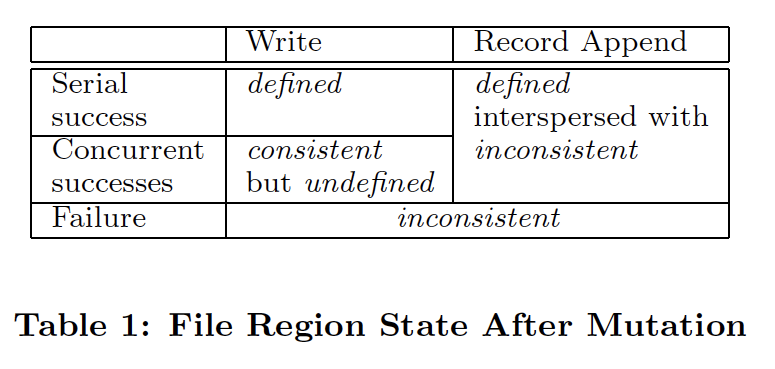
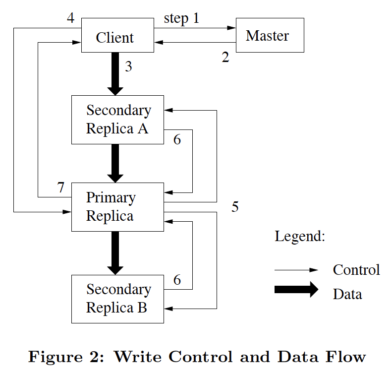

# GFS阅读笔记
GFS是谷歌建设大规模分布式存储系统的经验总结。
与传统的分布式文件系统的不同的一点是，GFS并不提供传统的POSIX标准的api，这是因为GFS面向的应用类型的操作需求多为顺序读写，且写操作多为追加操作，因此所有的设计都是以此作为大前提的，能使得GFS在谷歌内部得以良好的工作，面对高频随机读写的应用，GFS的效率会有所折扣。
依据论文中的描述，GFS可以在谷歌内部工作在由上千个节点组成的集群上，存储超过300TB的数据，服务于上百个应用，下面结合论文来谈一谈GFS的设计要点。  
## 1，设计总揽
### 1.1 设计假设
* GFS工作在非专业硬件上，因此宕机、断电、数据损坏等等事件随着集群运行时间的增加，几乎是必然会发生的，GFS必须要有能力监测、忍受部分故障，并拥有良好的机制可以从错误中恢复。
* GFS存储的文件数量应当是有限的、可预期的，通常存储的文件大小规模应当在100MB以上，GB级别的文件是最常见的文件规模，系统应当针对大文件进行优化，尽管系统也应当支持KB级别的小文件的存储，但是没有必要对其进行优化。
* GFS的读工作负载可大致分为两种类型：1，大规模的流式顺序读取（通常为数KB到数MB的级别）。2，小规模的随机读取（通常是几KB）。GFS假设，使用其的应用大部分时间都应该采用第一种的读取方式，如果应用需要进行第二种读取，那么应用应该在应用层面对多个小规模随机读取的请求作batch后再统一向GFS请求数据。
* 相应的，GFS的写工作负载也可以对应读工作负载的划分方式，GFS针对大规模的流式写入操作进行优化，支持小规模的随机写，但是并不保证效率。
* GFS应当提供并发写入的原子性保证，使用生产者消费者队列的方式对针对同一文件的来自不同应用的并发写操作排序，来保证在主副本上的并发写入顺序，以提供原子语义。
* 使用GFS的上层应用应对带宽更敏感，而不是对延迟更敏感，因为GFS的诸多优化都是牺牲响应的及时性来换取更大的数据通量。
### 1.2 接口
GFS提供了与操作系统文件操作接口类似的接口定义，包括：create(), delete(), open(), close(), read(), write()。  
此外GFS还提供了snapshot和record append操作，在后面详细讨论。  
### 1.3 架构
  
如图一所示，GFS的架构采用单一Master+多ChunkServer的方式组成，一个文件在GFS中存储时，被分成了多个chunk块，每个chunk块可能存储在不同的ChunkServer上，每个chunk块使用一个全局唯一的uint64_t的数字进行标识，由master在创建这个chunk块的时候对该chunk的标号进行赋值，保证唯一性。  
每个ChunkServer是一台运行着Linux操作系统的通用主机，Chunk块以Linux文件的形式在每个ChunkServer上进行存储。  
为了高可用性考虑，每一个chunk块在将会在不同的ChunkServer进行多副本方式的存储，以应对单一ChunkServer的突发故障，典型值是3副本，应用也可以根据需求自定义Chunk的副本数量（显然这么做需要付出效率上的额外代价）。  
master节点拥有集群范围内的所有元数据，master上存储了每个文件到每个chunkserver上的映射关系，并控制着集群范围内的chunk租约管理（用于在多副本中选出leader），垃圾chunk收集，以及在ChunkServer间进行chunk块的迁移。master通过定期的心跳来与集群中的每一台ChunkServer进行定期通信，检查它们的状态并且传递命令。  
使用GFS的应用，通过其客户端接口与master进行交互，从master上获取到要读取的文件的元数据后，与集群中对应的ChunkServer进行直接交互来完成数据的读写。  
GFS并未给客户端应用或者ChunkServer进行缓存设计，这是因为对于客户端应用来说，实际读取的数量通常是巨大的，并且是流式的，这将使得缓存的收益非常轻微（但是客户端会缓存元数据，因为元数据的信息量很少，而且是短时间内预期不变的），对于ChunkServer来说，使用Linux文件存储chunk块本身就可以利用Linux系统的文件缓存能力，而避免额外的设计（应该类似LRU机制）。  
### 1.4 单一Master
使用单一Master节点的好处在于，拥有全局的信息，可以进行更简单的流程设计。  
使用单一Master节点的挑战在于，要尽量减少其他节点，包括客户端与Master的交互，避免Master的计算能力、存储能力、IO带宽等成为系统的瓶颈。  
针对使用单一Master所面临的挑战，可以采用如下几种通用的方式来尽量规避：  
* 客户端只从master获取元数据，master不参与实际的数据读写操作。
* 客户端缓存元数据信息，以免多次访问相同的数据文件时与master作过多频繁的交互。
* 客户端在向master索要元数据信息的时候，作batch优化，一次索要多个。
### 1.5 Chunk块大小
在论文中，Google把GFS的chunk块的大小设计为64MB，这是Google针对他们的应用访问规律以及数据读写规模定制的一个较为合适的块大小。这种块大小远远超过了LInux系统设置的典型的文件块大小，这么做带来的负担就是可能会因为内部的磁盘空间碎片化导致一定程度上的空间浪费（例如采用预分配模式获取空间时，可能会因为磁盘上没有连续的64MB大小的空间导致chunk的创建失败，尽管磁盘可能还有几个T的空间余量），但是可以采用惰性空间分配策略来缓解（实时分配扩展，而不是预分配，可以更合理的利用散落的空间碎片）。  
一个较大的Chunk SIze的参数，可以带来一些显著的优势：  
* 首先，就是较大的块大小减少了客户端与master的交互，客户端可以一次获取一个足够大范围的chunk的元数据，而不需要在读取或者写入数据时因跨越多个chunk而频繁的与master交互以获取元数据。
* 其次，在一个较大的chunk块上，客户端更容易把多个操作进行batch聚合，例如，如果客户端想要读取文件的一处信息，并且修改文件的另一处信息，一个较大的chunk块的设计有更大的概率让这两个操作发生在同一个chunk块上，这可以让两个操作包含在同一条请求中，并只与一个ChunkServer进行一次交互。
* 最后，较大的Chunk块大小可以减少master的存储负担，因为每个Chunk块都需要在master上存储一份对应的元数据，同样的数据量，采用较小的Chunk块，将导致master记录更多的元数据信息。

但是chunk块并非是越大越好，过大的chunk块大小的设计将带来一些额外的负担：  
*  首先是存储空间浪费的问题，如果一个文件只需要几KB大小，但是文件中最小的空间分配的大小是64MB，那么将会造成客观的浪费。
* 其次是计算资源的浪费问题，如果一个文件的chunk块过大，同一时间的多个操作都集中在这一个chunk块里，也就意味着集中在一台ChunkServer上，将使得这个chunk块成为热点。
GFS在Google内部的实际应用中，确实也面临过他们所提到的第二个chunk热点问题，发生的场景是多个客户端并发从GFS中获取同一个可执行文件，使得存储该可执行文件的chunk块成为了系统热点，Google最终解决这一问题的方案是：1，增加这个chunk的副本数量，以应对更大规模的并发读取。2，把客户端读取相同chunk的时间打散，错峰读取。论文中提到，一种更有效的解决策略是让客户端互相之间也可以读取，以减轻GFS端的负载。
### 1.6 元数据
Master存储了三种主要的元数据：文件和chunk块的命名空间（用于区分不同应用创建的相同命名的数据文件），文件到Chunk及其副本的映射，以及每一个Chunk在ChunkServer上的位置。所有的元数据都全量保存在内存中（以加快客户端的访问速度并避免Master的磁盘IO成为系统瓶颈），前两种类型的元数据持久化的存储在磁盘中，以operation log的方式记录每一个操作，但是master并不存储chunk块的位置信息，这是因为chunk的实际位置可能会是频繁变更的，且存储chunk块的ChunkServer可能宕机或者网络分区导致不能为客户端提供数据读写服务。因此master宕机重启后通过与每个ChunkServer交互的方式来重新收集集群的所有chunk位置信息，以保证chunk位置信息的及时性和有效性。  
#### 元数据全量存储在内存中  
所有的元数据信息都存储在内存中，这使得master可以使用更小的代价定期扫描遍历所有的chunk块的状态，以决定是否执行chunk的垃圾回收、chunk的副本重分配、和chunk在不同ChunkServer间的迁移。  
对于把元数据全量存储在内存中的一种可能的担忧是内存的大小有限，是否可以存储下集群所有的chunk块的元数据信息，以GFS为例，64MB的chunk的元数据信息只有64字节，并且大部分chunk块存储的数据都是满的（一个文件通常会由多个chunk块组成，只有最后一个chunk块可能是不满的），因此chunk块的数量是可预期的，元数据的数量和大小也是可预期的。
#### chunk位置的获取策略
上文提到master采用重启时轮询每一个ChunkServer的方式来更新自己所存储的全局chunk位置信息，而不是持久化存储在磁盘中。master后续更新chunk位置信息的过程也是采用定期轮询的方式。  
首先是这样设计更为简单。   
其次是ChunkServer拥有它是否存有某一个chunk的最终话语权，master尽管可以将自己的信息持久化存储并在下次启动时以自己磁盘中的信息为准，但是对应的ChunkServer可能因为文件对应位置的磁盘数据已经损坏而不再持有这个chunk，持久化并不能保证master上存储的chunk块的位置信息的正确性。  
#### 操作日志
master上的操作日志包含了对所有元数据操作的历史修改，这是GFS上对元数据持久化存储的唯一方式，并且操作日志对所有的并发操作定了序。文件、chunk块，以及它们的版本号，都采用master上发生该操作的本地时间为它们进行唯一标识。
操作日志对GFS来说及其重要，因此操作日志要采用多副本的方式存储，并且直到元数据信息的改变操作已经持久化到本地和远程副本之后才可以响应客户端，否则就可能丢失近期的修改。master对多个操作进行batch写的方式来优化。  
master在宕机重启的时候通过回放操作日志的方式来恢复到系统宕机前的状态，由于随着时间的推移，master上操作日志的积累可能非常可观，导致master重启的恢复流程过长，因此master通过定期对本机状态生成快照点的方式来缩短回放的时间。  
### 1.7 一致性模型
GFS采用一个宽松的一致性模型。
下面就一致性这个纬度，讨论GFS接口对外提供的语义和保证。
GFS的保证
#### 1，数据一致性保证。
  
一个文件中的某块region被修改后的状态，取决于修改发生时的情况：修改是否返回成功？以及修改是否是并发的？
如上表，文件修改后的状态可以分为三种：  
* defined：defined状态包含了consistent状态，一个region是否是defined取决于读取这个region的应用是否认为这个region有意义，GFS本身并不能分辨一个region是否是defined状态。  
* consistent but undefined：当发生写入请求的应用得到success的响应，但是稍后读取它写入的region的内容的时候发现并不是它写入的内容，这意味着对同一个region发生了并发写操作，最终结果不是任何一个客户端期望的结果，region内的数据内容是没有意义的，但是GFS本身并不能判断这一点，GFS对每一个请求都返回了成功，并且在同一个chunk块的多个副本上保证了它们的二进制数据的一致性。  
* inconsistent：当一个写入操作失败的时候，应用没有收到来自GFS的success响应，那么本次的写入就可能造成region的inconsistent，inconsistent的region一定是undefined。  
换句话讲，如果GFS对一个修改操作返回了success，那么GFS保证这个修改造成的影响是consistent的，但是没有办法保证是defined。  
#### 2，数据追加写成功保证
GFS的数据写入分为指定offset的写入和record append写入两种。  
在record append写入中，GFS保证数据被写入至少一次，record append响应成功后，GFS返回给客户端一个写入位置的offset以及defined region的offset，defined region中包含了本次的写入，而defined region之外的部分可能被GFS填入padding或者重复写入数据，这部分defined region之外的region被认为是inconsistent的。  
因为客户端会缓存chunk的位置信息，因此客户端可能会读到一个缺失数据的副本上的数据，但是该情况不会持续发生，因为客户端会定期更新自己缓存的chunk块的位置信息，即便读取到旧的数据，客户端也通常只会少读取数据，而不是多读取数据，因为GFS上的操作大多都是append类型。  
GFS通过校验算法来保证chunk块信息的正确性，master定期与ChunkServer交互来确认其上存储的所有chunk块的正确行，一旦master发现了一个破损的chunk块，它将协调其他副本恢复信息损坏的chunk块上的信息，在一个chunk块损坏的情况下，GFS保证它自己能感知到这一错误，而不是返回给客户端错误的信息。  
#### 3，应用使用GFS时的正确用法
* 应用对于自己已经成功一系列写入操作生成快照点，快照点中包含了校验码：采用这种方式可以使得应用在读取数据的时候判断一段数据是不是defined，如果一段数据内容不符合校验这段数据的快照点中的校验码，通常意味着这段数据中在并发写入过程中掺杂了其他应用程序的写入。
* 应用级的写入序号标识：对于追加写操作，GFS提供的保证是append-at-least-once，这意味着应用在读取自己写入的数据的时候可能读取到重复的数据，如果应用程序处理数据的过程是非幂等的，那么应用程序通过对写入数据进行应用级的标识，就可以在读取数据的过程中过滤掉重复数据。
## 2， 系统交互
系统流程的设计原则是要让master尽量少的参与进来。  
将围绕数据修改，原子append，以及snapshot来描述。  
### 2.1 lease与修改顺序
GFS中每个chunk块采用多副本的方式进行存储，但是只有保证多个修改在多个副本上执行相同的顺序才能保证各副本间的数据的一致性。  
为此需要在多个副本中选出一个领导者副本，论文称为primary，primary副本接收数据修改请求，并把一系列请求定序，在自己和其他secondary上修改，以保证各副本间的数据一致性。  
primary由master指定，指定一个primary后，primary可能因为宕机或者网络分区等故障不再能提供服务能力，master需要有机制感知到这一情况，并选出另一个副本成为parimary，GFS通过让master与每个ChunkServer定期握手的方式，来实现primary的探活检测，当master想要更改parimary或者parimary不再响应master的探测心跳时，master只需要等待旧lease过期（在GFS中设置为60s），然后再把新的lease赋给另一台ChunkServer即可。  
  
图二描述了一个写操作的典型访问顺序。  
1，客户端访问master，获取到当前持有要访问的chunk块的lease的ChunkServer，以及它和其他副本的位置。  
2，master回复client需要的信息，client在本地缓存这些信息，以便下次访问可以跳过master，client只有在发现与primary的网络中断或者primary告知client他不再持有该chunk的lease的时候才会再次向master索要更新的数据。  
3， client将本次要写入该chunk块的信息，发送给任意的一个ChunkServer，ChunkServer互相之间会同步这些数据（以不确定的顺序），每个chunk副本收到要写入的数据后，暂时缓存在其LRU缓存中，只有在写入完成或者被LRU淘汰的时候才会从缓存中移除。  
4，一旦向所有的副本写入数据完成后，client通知primary，client发给parimary的请求中指定了它之前已经写到所有副本中的数据的标识，primary将来自多个client的所有数据写请求定序，并写入本地。  
5，parimary把写入请求以及写入顺序发送给其他的secondary，其他的secondary将以相同的顺序写入相同的数据。
6，所有的secondary已经完成写入操作后回复primary。  
7，parimary回复客户端，任何副本在任何过程中的错误都将使得本次写入失败，写入失败可能导致写入操作仅在某几个副本上成功了，各副本的数据可能处于不一致的状态。客户端将视错误码对3-7部进行若干次重试。  
如果一个应用的写入的数据量足够大，或者写入的数据跨越了chunk的边界，那么GFS客户端会把这个写请求分为多个进行写入，每个写请求通过上面描述的流程进行写入，中间可能会穿插来自其他客户端的并发写入操作，并发写入操作可能造成文件的某个区域包含了来自多个客户端的数据帧，这使得该文件区域对任何一个客户端来说都是无意义的，但是因为每个写入操作都是成功的，因此GFS中相关的chunk块都是一致的，这就是GFS中定义的“undefined but consistent”。  
### 2.2 数据流
数据流和控制流互相独立，可以增加网络的利用效率。  
控制流从client到primary，再从primary到secondary。  
数据流以一个链表的形式串起来，从一个chunkserver到另一个chunkserver，互相之间存在一条线的通路，这样可以更有效的利用所有机器上的带宽，chunkserver串连的方式也应当妥当设计，以最大化的减少数据传输延迟。  
使用这种方式在两台机器间传输数据的计算方式为：B/T+RL，其中B表示B个字节数据，T表示机器的带宽，论文中的典型值为百兆以太网，R表示副本的数量，L表示两台机器间的数据传输延迟，论文中的典型值是1ms，在多副本间传输1MB数据的典型耗时约为80ms。  
### 2.3 原子追加写
追加写操作的流程和普通写入流程基本类似，稍有区别在于追加写要跨chunk的情况，此时需要创建新的chunk块，但是创建新的chunk块的操作需要master来指定，因此当发生追加写操作的数据到达一个chunk块的最大值的情况的时候，primary会拒绝掉这次写入，把这个chunk块用padding字符填满，然后告诉客户端在新的chunk块上重试。  
客户端一次写入操作的最大值被严格限制在1/4个chunk块的大小内。  
### 2.4 快照点
创建快照点的操作可以使得master上的操作日志记录的数据量变少，并且减少master重启时的恢复时间。  
创建快照点的操作采用类似写时复制的方式进行，首先master等待文件的所有chunk的primary上的lease过期，这可以保证任何创建快照点后的写入操作都会来master询问一个新的chunkserver。  
然后当客户端过来企图询问有关的chunk的元数据的时候，master先命令持有那些chunk块的chunkserver复制一个相同的chunk块，然后从新的chunk块中选一个当primary，让后续的命令都与新的chunk块的primary进行交互。  